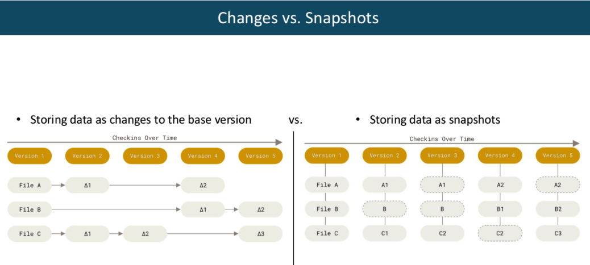

# Changes vs Snapshots

-> Git은 snapshots 방식.
# Local, Centralized, and Distributed Version Control
.png)

# Three States in Git

# Git config : first-time setup

# init, status, add, rm(Unstage), ignore, commit, change

